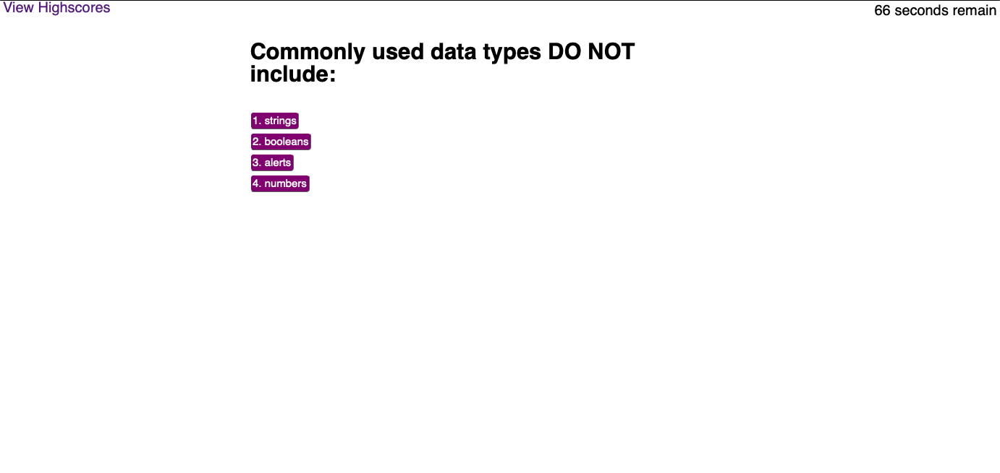
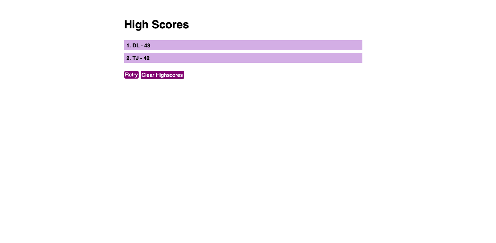

# hw-4

Javascript Quiz:
Click start quiz, then answer the questions before the time runs out.
Each incorrect answer will subtract time.
Your time at the end will count as your score, which will be displayed on the leaderboard.

Screenshots:

Created by David Ludwik

The program cycles through an array of questions.
Upon clicking an answer, the target of the click is compared to the value at a corresponding index in a dedicated rubric array called answerArray.

Time remaining is displayed/adjusted via a set interval function.
Data needed between multiple html pages is stored in local storage.
The resulting score is stored in its own array. 

Each entry into the highscore array is inserted such the the array is sorted by score in descending order. The leaderboard is cleared simply by clearing local storage and refreshing page.

